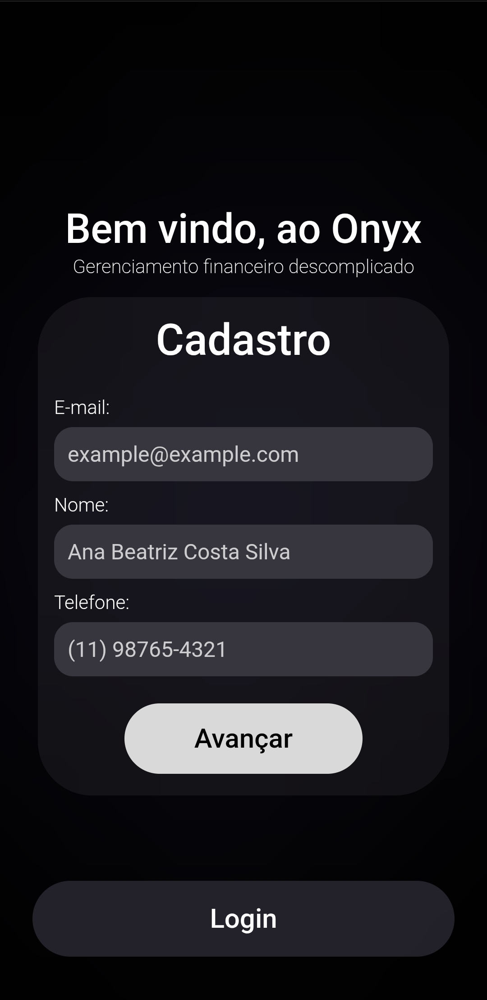
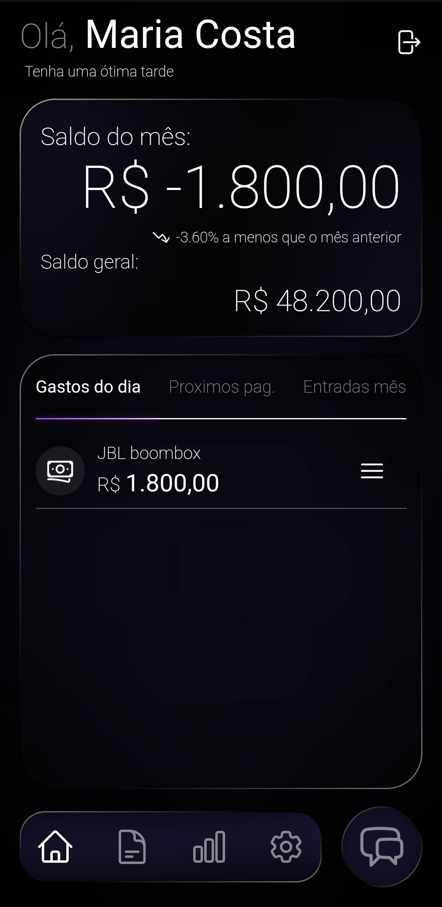
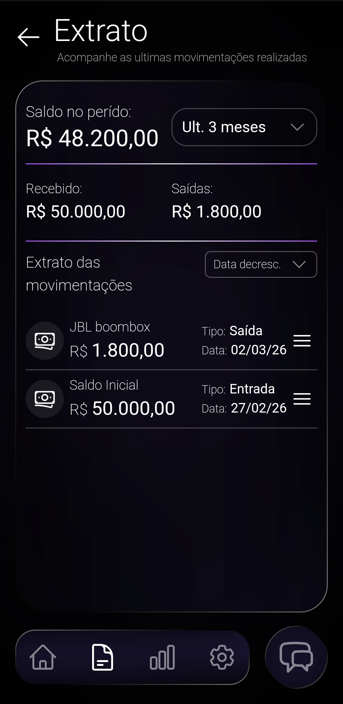
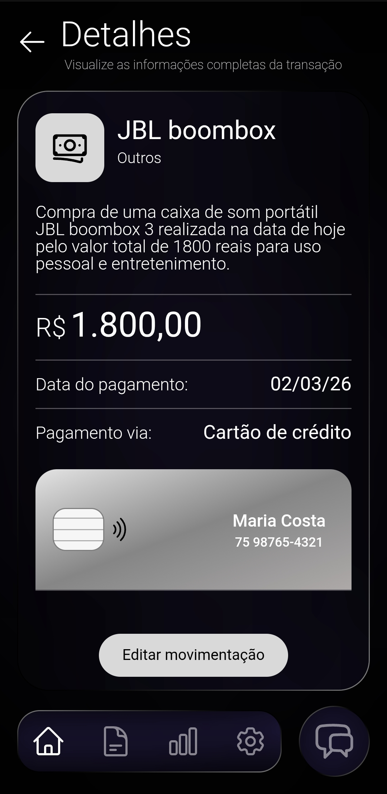

# 💎 Onyx - Finance Management

<div align="center">
  
  
  <p><strong>Gestão financeira inteligente, moderna e segura.</strong></p>

  <p>Para utilizar a aplicação, basta acessar: <strong><a style='color: violet;' href='https://onyxrp11.netlify.app'>Onyx - Finance Management</a></strong></p>

  
  
  
  
  
  
</div>

<br/>

## 📋 Índice
 - [Sobre o Projeto](#-sobre-o-projeto)
 - [Principais Funcionalidades](#-principais-funcionalidades)
 - [Objetivo e Motivação](#-objetivo-e-motivação)
 - [Tecnologias Utilizadas](#-tecnologias-utilizadas)
 - [ChatBot Inteligente](#-chatbot-inteligente)
 - [Estrutura do Projeto](#-estrutura-do-projeto)
 - [Hospedagem](#-hospedagem)
 - [Como Executar Localmente](#-como-executar-localmente)
 - [Demonstração](#-demonstração)
 - [Autor](#-autor)

## 📖 Sobre o Projeto

O **Onyx - Finance Management** é uma aplicação Full-Stack de gerenciamento financeiro pessoal projetada para oferecer uma experiência de usuário fluida e intuitiva. Combinando um design moderno com uma arquitetura robusta de segurança, o sistema permite a adição de transações sem a necessidade de preencher longos formulários, graças à integração de um ChatBot inteligente.

O projeto também inova ao eliminar a fricção das senhas tradicionais, utilizando a tecnologia WebAuthn para logins biométricos (como FaceID e TouchID) através de passkeys.

## ✨ Principais Funcionalidades

* **🔐 Autenticação Passwordless:** Login seguro via biometria utilizando a API WebAuthn, eliminando necessidade de digitar senhas.
* **🤖 ChatBot Integrado:** Facilitador conversacional para o registro de gastos e receitas de forma natural e rápida.
* **📊 Dashboard Dinâmico:** Visão geral e atualizada do saldo, despesas do dia, próximos pagamentos e panorama mensal das entradas.
* **🧾 Extrato Detalhado:** Filtros inteligentes por período, ordenação customizada e visualização detalhada de transações isoladas.

## 🎯 Objetivo e Motivação

Este projeto nasceu do objetivo de descomplicar o controle de gastos diários. A ideia principal foi eliminar a necessidade de planilhas complexas trazendo o controle financeiro para a palma da mão de forma extremamente acessível.

A motivação central foi transformar o ato de registrar uma despesa em algo tão simples quanto enviar uma mensagem para um amigo. Com o fluxo simplificado, a visualização da saúde financeira se torna clara, rápida e sem atritos.

## 💻 Tecnologias Utilizadas

### Frontend
* **React & TypeScript:** Desenvolvimento baseado em componentização dos elementos, com tipagem estática para maior segurança e organização do código.
* **Tailwind CSS:** Estilização utilitária e responsiva e de fácil desenvolvimento.
* **Vite PWA:** Configuração que permite a instalação da aplicação (PWA), funcionando como um aplicativo nativo no dispositivo do usuário.

### Backend
* **FastAPI:** Framework Python de alta performance para construção de APIs assíncronas.
* **SQLAlchemy:** ORM utilizado para a modelagem e interação com o banco de dados.
* **PostgreSQL:** Banco de dados relacional robusto para armazenamento seguro das transações.
* **WebAuthn:** Implementação nativa do FIDO2 para biometria.
* **JWT Token:** Autenticação e controle de sessão nas requisições da API.
* **Gemini AI:** Inteligência Artificial do Google integrada para processar linguagem natural e categorizar as mensagens do usuário.

## 🤖 ChatBot Inteligente

Seguindo o objetivo central de tornar o controle financeiro fácil e ágil, o Onyx conta com um ChatBot alimentado pela API do **Gemini AI**. Em vez de navegar por menus e preencher valores manualmente, o usuário pode simplesmente enviar uma mensagem como *"Gastei 50 reais com pizza ontem"* e a Inteligência Artificial se encarrega de extrair o valor, a data, categorizar a despesa e salvar no banco de dados automaticamente.

## 🏗 Estrutura do Projeto

### Frontend
A interface foi organizada baseando-se na separação clara de responsabilidades:
* **Assets:** Arquivos de mídia, imagens e fontes utilizados no projeto.
* **Components:** Componentes reutilizáveis (botões, inputs, cards) que compõem as interfaces.
* **Hooks:** Lógicas customizadas do React e comunicação isolada com a API.
* **Interfaces:** Definições de tipagem (TypeScript) utilizadas pelos componentes.
* **Layouts:** Componentes estruturais de roteamento (Wrappers) que utilizam o `<Outlet />` para envolver e padronizar as páginas filhas (como Dashboard e Extrato) mantendo a estrutura base.
* **Pages:** Arquivos principais que representam as telas completas da aplicação.
* **Routes:** Controle de roteamento, protegendo páginas privadas e liberando rotas públicas.
* **Services:** Configurações de serviços externos, instâncias do Axios, controle de Cookies e Tokens.
* **Utils:** Funções auxiliares e genéricas reutilizadas em diferentes partes do código.

### Backend
O servidor adota uma arquitetura modular para facilitar a manutenção e escalabilidade:
* **Controllers:** Lida com a lógica de negócio e regras do CRUD para cada entidade.
* **Core:** Núcleo de configurações da aplicação (conexão com o banco, variáveis de ambiente).
* **Models:** Definição das tabelas do banco de dados (SQLAlchemy).
* **Routers:** Endpoints da API expostos para acesso externo.
* **schemas:** Modelos Pydantic para validação de dados de entrada e saída (Tipagem das requisições).
* **Services:** Integrações com serviços externos, como envio de e-mails ou chamadas à IA.
* **Utils:** Funções auxiliares de lógicas utilitárias ao longo do código.

## ☁️ Hospedagem

O projeto foi disponibilizado online (deploy) utilizando uma arquitetura em nuvem distribuída e gratuita:

* **[Netlify](https://www.netlify.com/):** Hospedagem da aplicação Frontend (React/Vite).
* **[Koyeb](https://www.koyeb.com/):** Hospedagem e execução do container do Backend (FastAPI).
* **[Neon](https://neon.com/):** Banco de dados PostgreSQL serverless.

## 🚀 Como Executar Localmente

Siga os passos abaixo para rodar a aplicação completa na sua máquina utilizando contêineres. O banco de dados utiliza volumes do Docker para persistir as informações entre as execuções.

### Pré-requisitos
* [Docker](https://www.docker.com/) instalado
* Docker Compose

### Passo a Passo

1. **Clone o repositório:**
   ```bash
   git clone https://github.com/rhianpablo11/onyx_finance_management.git
   ```
   ```bash
   cd onyx_finance_management
   ```


2. **Configure as Variáveis de Ambiente:**

    No arquivo `docker-compose.yaml` há os campos das variaveis de ambiente, é importante preenche-los para o funcionamento completo localmente. Os campos `GEMINI_API_KEY` e `PASSWORD_EMAIL` se referem a chave da API da Gemini a ser utilizada para o ChatBot, e em sequência a senha do email que será utilizado para envio dos códigos de recuperação e verificação do email. Para isso também é preciso indicar qual o email que será utilizado, para isso preencher a variavel `ADDRESS_EMAIL`.
    


3. **Suba os contêineres com o Docker Compose:**
    ```bash
    docker compose up --build
    ```


    *O backend se encarregará de criar as tabelas do banco de dados automaticamente na primeira inicialização.*
4. **Acesse a aplicação:**

    Abra `http://localhost:5173` no seu navegador para ver o Frontend rodando. A documentação da API (Swagger) estará disponível em `http://localhost:8000/docs`.


## 🎨 Screenshots

<div align="center">
  
  
  

</div>

<div align="center">
  
  
  
  
</div>


## 👨‍💻 Autor

Desenvolvido por **[Rhian Pablo](https://www.linkedin.com/in/rhianpablo11/)**, estudante de Engenharia da Computação - Universidade Estadual de Feira de Santana (UEFS).

